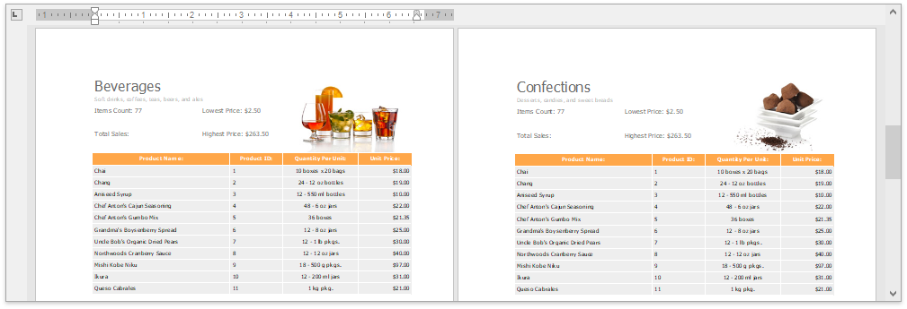

<!-- default badges list -->

<!-- default badges end -->

# Rich Text Editor for WinForms - Create a Master-Detail Report

This example illustrates an older approach to creating master-detail documents.

>[!tip]
> To learn about a newer and more convenient approach to master-detail mail merge, refer to the following article: [Create a Master-Detail Report with a Detail Report Band](https://docs.devexpress.com/XtraReports/4785/create-reports/create-a-master-detail-report-with-a-detail-report-band).

This project uses a two-level **Categories-Products** hierarchical data source, retrieved from the **nwind.xml** file. 

## Files to Review

* [Form1.cs](./CS/RichEditMasterDetailMailMerge/Form1.cs) (VB: [Form1.vb](./VB/RichEditMasterDetailMailMerge/Form1.vb))

## Documentation

* [How to: Create a Master-Detail Report](https://docs.devexpress.com/OfficeFileAPI/15329/word-processing-document-api/examples/mail-merge/master-detail-report)

