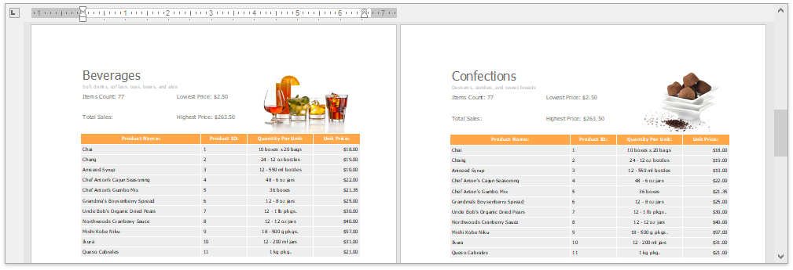
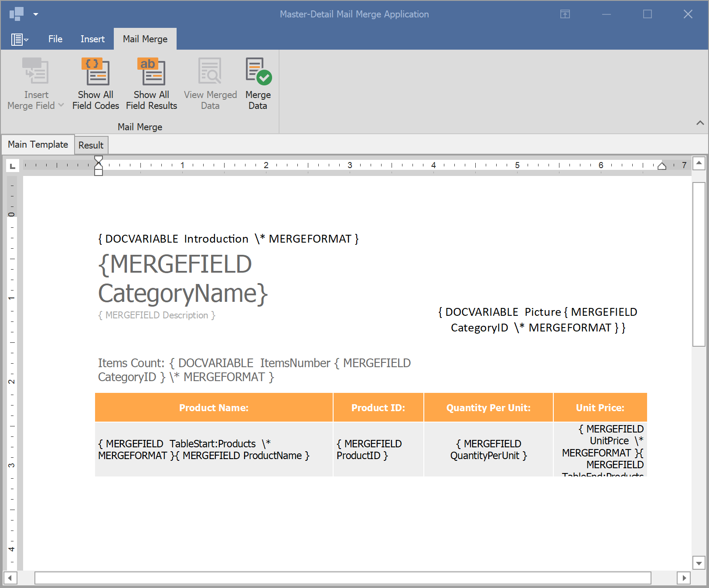
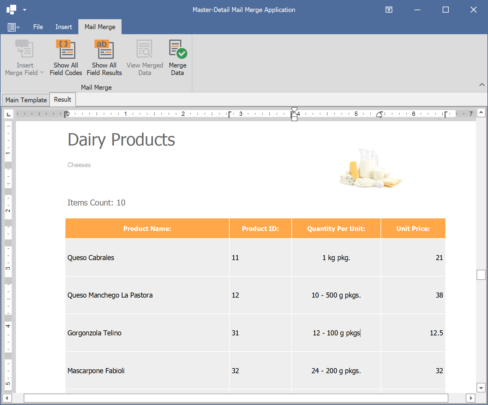

<!-- default badges list -->

<!-- default badges end -->

# Rich Text Editor for WinForms - Use Mail Merge to Create a Master-Detail Report

This example uses the Rich Text Editor control and its Mail Merge functionality to generate a product catalog report based on a master-detail template.

This project uses a two-level **Categories-Products** data source retrieved from **nwind.xml**. 

## Implementation Details

Rich Text Editor supports master-detail mail merge templates. ``TableStart:Name`` and ``TableEnd:Name`` merge fields define master and nested detail regions. Region names should match group or table names in your data source. 

This example loads the template to the `RichEditControl` instance located in the **Main Template** tab.

This example uses the following APIs to specify the data source: 

- [RichEditControl.CreateMailMergeOptions()](https://docs.devexpress.com/OfficeFileAPI/DevExpress.XtraRichEdit.RichEditControl.CreateMailMergeOptions) method - initializes an object with mail merge settings. 
- [RichEditMailMergeOptions.DataSource](https://docs.devexpress.com/OfficeFileAPI/DevExpress.XtraRichEdit.RichEditMailMergeOptions.DataSource) - sets the data source. 
- [RichEditControl.MailMerge](https://docs.devexpress.com/OfficeFileAPI/DevExpress.XtraRichEdit.RichEditControl.MailMerge.overloads) method - accepts the settings object as a parameter. 

In this project, the [RichEditControl.MailMerge](https://docs.devexpress.com/OfficeFileAPI/DevExpress.XtraRichEdit.RichEditControl.MailMerge.overloads) method exports the result to the `RichEditControl` instance located in the **Result** tab.

## Files to Review

* [Form1.cs](./CS/Form1.cs) (VB: [Form1.vb](./VB/Form1.vb))

## Documentation

* [Mail Merge in Rich Text Documents](https://docs.devexpress.com/WindowsForms/9330/controls-and-libraries/rich-text-editor/mail-merge)

<!-- feedback -->
## Does this example address your development requirements/objectives?

 

(you will be redirected to DevExpress.com to submit your response)
<!-- feedback end -->
